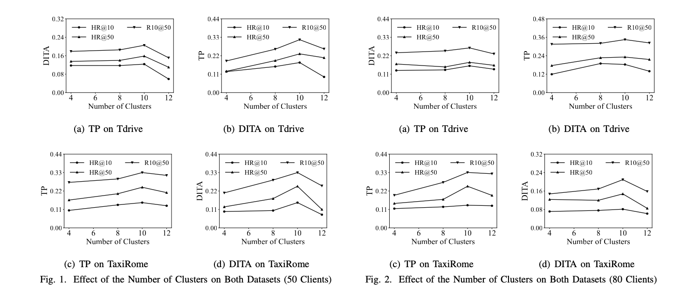

# F-TSL

Code for the paper: Federated Trajectory Similarity Learning with Privacy-Preserving Clustering (Under Review)


## Requirements

- Ubuntu OS
- Python >= 3.5 (Anaconda3 is recommended)
- PyTorch 1.4+
- A Nvidia GPU with cuda 10.2+

## Datasets

* We use open-sourced trajectory datasets [TDrive](https://www.microsoft.com/en-us/research/publication/t-drive-trajectory-data-sample/), Rome.
* We provided the road network data and map-matching result data for both Tdrive and TaxiRome datasets. For full datasets, please refer to [GoogleDrive](https://drive.google.com/drive/folders/1LV4aWEgmGZ0gf5H7IvskVnHiUTEdoe1O?usp=drive_link).
* More data can be obtained from [OpenStreetMap (OSM)](https://www.openstreetmap.org/)
## Reproducibility & Training

1. Data preprocessing (Time embedding and node embedding)

   ```shell
   python preprocess.py
   ```

2. Ground truth generating (It will take a while...)

   ```shell
   python spatial_similarity.py
   python temporal_similarity.py
   ```

3. Triplets generating

   ```shell
   python data_utils.py
   ```

4. Training

   ```shell
   python federated_main.py 
   ```
# The effect of cluster numbers


In the experiment study, we consider 100 clients and find that the proposed F-TSL obtains the best results when setting the number of clusters to 10. 
To provide a better guideline for how to choose this hyper-parameter, we conduct two additional sets of experiments, setting the numbers of clients to 50 and 80, 
respectively. The results are shown in above Figures. These results provide evidence that using ten clusters is reasonable. 
Setting the number of clusters to 10 generally yields better model performance.
